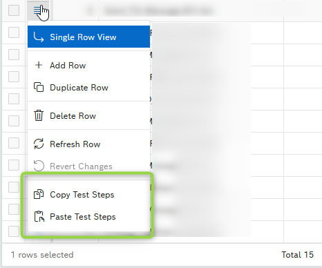

# Oracle APEX Plugin: Interactive Grid – Custom Context Menu

## 👤 Author

**Naveen Saini**

---

## 📌 Overview

The **Interactive Grid – Custom Context Menu** plugin is a Dynamic Action plugin for Oracle APEX that enhances the standard Interactive Grid by adding a **custom context menu entry** to the **row selector (hamburger menu)**.

This menu entry can:

* Act as a **clickable action**
* Be rendered as a **visual separator**
* Invoke an **AJAX Callback process** with selected row primary keys

---

## 🚀 Features

* Add custom menu item to Interactive Grid row selector
* Support for **single and multiple row selection**
* Optional **separator rendering**
* Integration with **AJAX Callback processes**
* Supports **Font APEX / Font Awesome icons**
* Works seamlessly with **Interactive Grid refresh cycles**

---

## 🖼️ Preview



---

## ⚙️ Installation

1. Download `plugin.sql` from the `/src` directory
2. Navigate to:

   * Shared Components → Plugins
3. Click **Import**
4. Upload the plugin file
5. Save and install

---

## ▶️ Usage

1. Create a **Dynamic Action**

2. Select:

   * Event: `Page Load` or `After Refresh`

3. Add Action:

   * **Execute Plugin**

4. Configure plugin attributes (see below)

---

## 🔧 Plugin Attributes

### Attribute 01 – Interactive Grid Static ID *(Required)*

Enter the **Static ID** of the Interactive Grid region where the custom context menu should be added.

---

### Attribute 02 – Show as Separator *(Optional)*

Controls whether the menu entry is rendered as a separator.

* `Y` → Render as menu separator
* `N` → Render as normal menu item *(default)*

---

### Attribute 03 – Menu Label *(Required unless Separator = Y)*

Text displayed for the custom menu item.

> Ignored if **Show as Separator = Y**

---

### Attribute 04 – Menu Icon *(Optional)*

CSS class for the icon displayed next to the menu label.

Supported:

* Font APEX
* Font Awesome
* Custom CSS classes

> Leave blank if not required

---

### Attribute 05 – AJAX Callback Process Name *(Required unless Separator = Y)*

Name of the **AJAX Callback process** defined on the page.

Triggered when menu item is clicked.

You can access selected row data using:

```plsql
apex_application.g_x01 ... g_x10
```

---

### Attribute 06 – Primary Key Column Name *(Required unless Separator = Y)*

Database column representing the **primary key** of the Interactive Grid.

Used to identify and pass selected row(s) to the AJAX process.

---

## 🧪 Example Use Cases

* Copy selected rows
* Delete selected records
* Trigger custom business logic
* Bulk update actions
* Custom workflow triggers

---

## 📦 Demo Application

Import demo app from:

```
/demo/demo_app.sql
```

---

## ⚠️ Notes

1. Row Selector must be enabled in the Interactive Grid
2. Supports both **single and multiple row selection**
3. Designed for actions like Copy, Delete, and custom processing
4. Compatible with standard Interactive Grid behavior

---

## 🛠 Requirements

* Oracle APEX 21.2 or higher
* Oracle Database 19c or higher

---

## 🐞 Known Issues

* None currently identified

---

## 🗺 Roadmap

* Add support for dynamic menu visibility
* Add confirmation dialog support
* Support additional payload formats (JSON enhancements)

---

## 🤝 Contributing

Contributions and suggestions are welcome.
Feel free to open issues or submit pull requests.

---

## 📄 License

MIT License

---

## ⭐ Support

If you find this plugin useful, consider giving the repository a ⭐ on GitHub.
